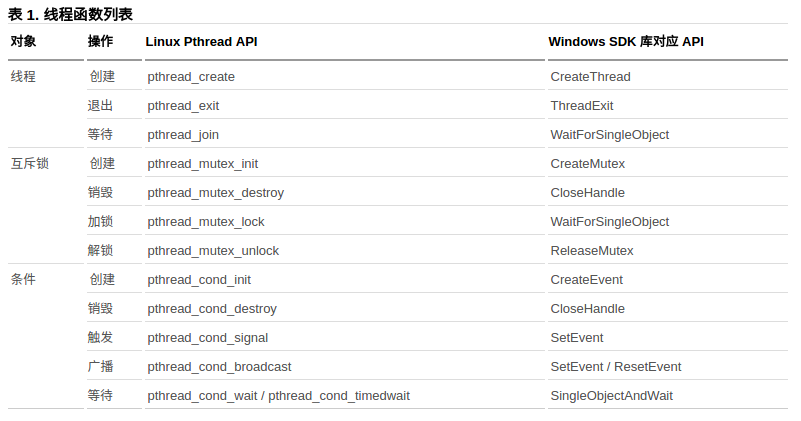

## 并发编程

### 并发

罪简单和最基本的并发，是指两个或两个以上 **独立** 的活动，**同时** 发生。计算机中并发的两种方式包括：**多核处理器的真正并行** 和 **单核处理器的任务切换**；其基本实现途径也有两种：**多进程并发** 和 **多线程并发**。

通常，多进程并发具有以下优势：1）操作系统在进程间提供的附加保护操作和更高级别的通信机制，可以更容易编写安全的代码；2）可以使用远程连接的方式在不同的机器上运行独立的代码。

多线程并发，是指在同一进程中运行多个线程，每个线程相互独立运行，且线程可以在不同的指令序列中运行，线程间通过 **共享内存** 进行通信。

### Linux POSIX线程

Linux是以一种"多进程单线程"的操作系统，只有进程的概念，Linux系统中称为“任务(task)”，其所谓的”线程“本质上在内核里是进程。进程是CPU分配的基本单元，同一进程中的所有线程共享进程资源。

POSIX(可移植操作系统接口)线程是提供代码响应和性能的有力手段，是Linux操作系统线程处理的标准接口。_值得注意的是，POSIX线程中不存在“父线程”和”子线程“的层次关系，主线程可以创建一个新线程，新线程可以创建另一个新线程，POSIX线程标准将它们视为等同的层次_。

Linux多线程开发最基本概念主要包括：线程，互斥锁，条件。其中，线程操作分为线程的创建，退出，等待三种。互斥锁操作分为创建，销毁，加锁和解锁四种。条件操作分为创建，销毁，触发，广播和等待五种。

线程，互斥锁，条件在Linux平台上对应的API如下图所示。



### 值得注意的5个地方

#### 1 尽量设置recursive属性以初始化互斥锁

互斥锁的调用次序一定要牢记：建锁，加锁，解锁，销毁。默认情况下，Linux下同一个线程无法对同一锁进行地柜加锁(同一线程中对互斥锁进行两次或两次以上的行为)，否则出现死锁。

对互斥锁设置recursive属性进行初始化，不仅可以解决同一线程的递归加锁问题，也可以避免死锁的发生，还可以让windows和Linux下锁的表现统一。例如：

```c
pthread_mutex_t *mymutex = new pthread_mutex_t;
pthread_mutexattr_t attr;
pthread_mutexattr_settype(&attr, PTHREAD_MUTEX_RECURSIVE_NP);
pthread_mutex_init(mymutex, &attr);
//加锁与解锁
pthread_mutex_lock(mymutex);
pthread_mutex_unlock(mymutex);
```

####
