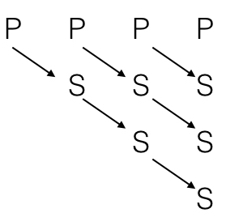

操作系统中长期调度、中期调度、短期调度的区别
http://blog.csdn.net/u013007900/article/details/50550415

### fork()函数

fork()函数 **仅调用一次，却能够返回两次**。其返回值有三种可能：

1）在父进程中，返回新创建的子进程的PID;  
2）在子进程中，返回0；  
3）出现错误，返回一个负值。  

为什么fork()的返回值在父子进程中不同？因为，进程形成链表，父进程的pid(相当于指针)指向子进程的id，而子进程没有其子进程，pid为0。

子进程创建成功后，系统中出现两个完全相同的进程，**执行的先后顺序依系统的进程调度策略而不同**。在Ubuntu16.04中 **先执行父进程，再执行子进程**，如下图所示：



实例1说明：

```
//采用Ubuntu16.04系统(先执行父进程，再执行子进程)
#include <sys/types.h>
#include <stdio.h>
#include <stdlib.h>
#include <unistd.h>
int value = 5;
int main() {
  pid_t pid;
  pid = fork();
  if(pid < 0)
    printf("error in fork()\n");
  else if(pid == 0) {
    value += 15;
    printf("CHILD: value = %d\n", value);
    printf("CHILD PID: %d\n", getpid());
  } else if(pid > 0) {
    printf("PARENT: value = %d\n", value);
    printf("PARENT PID: %d\n", getpid());
    printf("MY CHILD PID : %d\n", pid);
  }
}
```

其输出为：

```
PARENT: value = 5
PARENT PID: 3341
MY CHILD PID : 3342
CHILD: value = 20
CHILD PID: 3342
```

实例2说明：

```
//采用Ubuntu16.04
#include <sys/types.h>
#include <stdio.h>
#include <stdlib.h>
#include <unistd.h>
int value = 5;
int main() {
  for(int i = 0; i < 3; i++) {
    pid_t fpid = fork();
    if(fpid < 0)
      printf("error in fork()\n");
    else if(fpid == 0) {
      printf("CHILD\n");
    } else if(fpid > 0) {
      printf("PARENT\n");
      printf("\n");
    }
  }
}
```

其输出为：

```
PARENT

PARENT

CHILD
PARENT

PARENT

CHILD
PARENT

CHILD
PARENT

PARENT

CHILD
CHILD
CHILD
```


### 线程

实例说明：

```
#include <pthread.h>
#include <stdio.h>
#include <sys/types.h>
#include <unistd.h>
#include <sys/wait.h>
int value = 0;
void *runner(void *param) {
  value = 5;
  pthread_exit(0);
}
int main() {
  int pid;
  pthread_t tid;
  pthread_attr_t attr;
  pid = fork();
  if(pid == 0) {
    pthread_attr_init(&attr);
    int id = pthread_create(&tid, &attr, runner, NULL);
    pthread_join(tid, NULL);
    printf("CHILD: value = %d\n", value);
  } else if(pid > 0) {
    wait(NULL);
    printf("PARENT: value = %d\n", value);
  }
}
```

其输出为：

```
CHILD: value = 5
PARENT: value = 0
```
