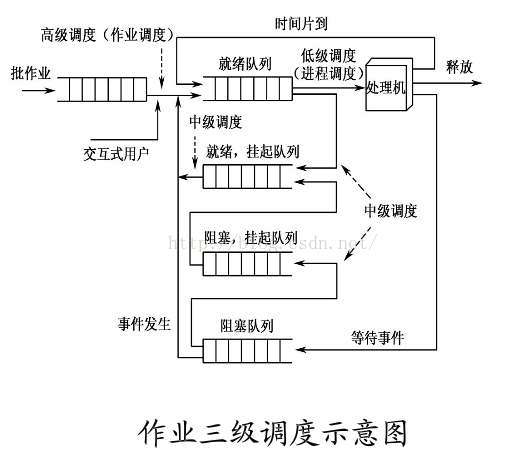
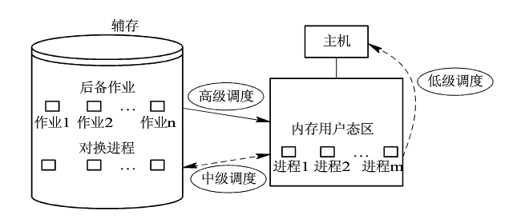

# 进程管理部分

## #1进程

### 进程

进程是执行中的程序，是大多数系统的工作单元，是 **活动实体**。一般，进程具有以下几种状态：新的，运行，等待，就绪，终止。每个进程在操作系统中用进程控制块(PCB)表示，其包含许多与一个特定进程相关的信息(进程状态，程序计数器，CPU寄存器，CPU调度信息，内存管理信息，记账信息，I/O状态信息等)。

**进程调度**

进程调度是指选择一个可用的进程到CPU上执行的过程，由相应的 **调度程序** 来执行。进程进入系统后，进入 **作业队列** (包含系统中的所有队列)；驻留在内存中就绪，等待执行的进程位于 **就绪队列**。就绪队列通常用链表实现，其头节点指向链表的第一个和最后一个PCB块的指针；每个PCB包括一个指向就绪队列的下一个的PCB的指针域。



调度程序分为 **长期调度程序**, **中期调度程序** 和 **短期调度程序**。长期调度(高级调度)，又称为 **作业调度**，是指从池中选择进程，并装入内存准备执行，其使用频率比较低，主要用来控制内存中进程的数量；中期调度(中级调度)，又称为 **交换调度**，是指将进程中内存或CPU竞争中移出，从而降低多道程序设计的程度，之后进程被重新装入内存；短期调度(低级调度)，又称为 **进程调度**，是指按照一定的策略和算法，将CPU分配给一个处于就绪的进程，分为 **抢占式** 和 **非抢占式**。



**上下文切换**

将CPU切换找另一个进程需要保存当前进程的状态，并恢复另一个进程的状态，这个过程称为上下文切换。

### 进程操作

**进程创建** 和 **进程终止**

进程创建新进程时，有两种执行可能：

1）父进程与子进程并发执行；2）父进程等待，直到某个子进程或全部子进程执行完毕。

同样，新进程的地址空间也有两种可能：

1）子进程是父进程的复制品（具有父进程相同的程序和数据）；2）子进程装入一个新程序。

在linux系统，使用fork()函数可以创建一个新进程，相关内容参考[fork()函数](fork.md)

当进程完成执行最后的语句病使用系统调用exit()请求操作系统删除自身时，进程终止。进程终止时，可以返回状态值(整数)到父进程(通过系统调用wait())，所有进程资源将会被操作系统回收。

### 进程间通信

进程间通信(IPC)有两种基本模式：**共享内存** 和 **消息传递**。进程间通信可以调用send()和receive()来进行，其可分为 **阻塞** 或 **非阻塞**——也称为 **同步** 和 **异步**。

阻塞send: 发送进程阻塞，直到消息被进程或邮箱所接收；  
非阻塞send: 发送进程发送消息并继续操作；  
阻塞receive: 接收进程阻塞，直到有消息可用；  
非阻塞receive: 接收进程接收到一个有用消息或空消息；

值得注意的是，无论是直接通信还是间接通信，通信进程的消息的驻留在临时队列中。队列的实现有三种方式：零容量，有限容量，无限容量。

**共享内存实例**

创建共享内存段shmget()

```C++
//三个参数：标识符，字节数，读写模式
//函数返回整数标识值
segment_id = shmget(IPC_PRIVATE, size, S_IRUSR | S_IWURS);
//三个参数：共享内存段的ID，指针，读写模式
//返回初始位置的指针
share_memory = (char *)shmat(id, NULL, 0);
//删除共享内存段，释放指针
shmdt(share_memory);
shmctl();
```

**消息传递**: Mach

Mach系统主要为分布式系统设计。在Mach系统中，每个任务创建时，同时创建了两个特别的邮箱：**内核邮箱** 和 **通报邮箱**。内核使用内核邮箱与任务通信，使用通报邮箱发送事件发生的通知。

消息传递使用三个系统调用：

1）msg_send():发送数据；  
2）msg_receive():接收数据；  
3）msg_rpc():发送远程消息，并只等待来自发送者的一个返回消息；  

值得注意的是，Mach可以确保来自同一个发送者额多个消息满足FIFO顺序排队，但不是绝对顺序。即两个发送者的消息可以任意排队。其次，Mach使用的是双重复制机制(发送者<--复制-->邮箱<--复制-->接收者)。若使用虚拟内存管理技术(即将发送者的地址空间映射到接收者的地址空间，但只适用与系统内部)，可以避免这种双重复制。

### 进程小结

进程是执行中的程序。随着程序的执行，它改变状态。进程状态由进程当前活动所定义。每个进程可处于：新的，就绪，执行，等待或终止状态。每个进程在操作系统内通过自己的进程控制块PCB来表示。当前不执行的进程放在某个等待队列中。操作系统有两种主要队列：**I/O请求队列** 和 **就绪队列**。就绪队列包括所有准备执行或等待CPU的进程。每个都有PCB，PCB链接起来就形成了就绪队列。长期调度通过选择进程来争用CPU。短期调度从就绪队列中选择进程。

操作系统的执行进程可以是独立进程，也可以是协作进程。协作进程需要进程间有互相通信机制，主要有两种形式：共享内存和消息传递。**共享内存** 方法通过要求通信进程共享一些变量，进程通过使用共享变量来交换信息；而 **消息系统** 方法允许进程交换信息。
